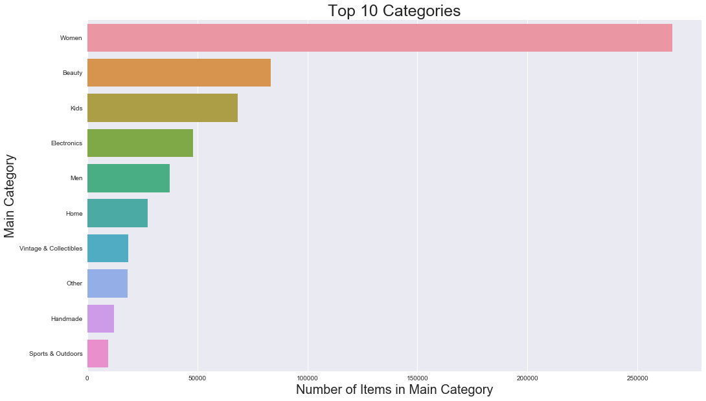

# Mercari Price Suggestion Challenge
***
### Can you automatically suggest product prices to online sellers?

**Product pricing gets even harder at scale**, considering just how many products are sold online. Clothing has strong seasonal pricing trends and is heavily influenced by brand names, while electronics have fluctuating prices based on product specs.

**Mercari**, Japan’s biggest community-powered shopping app, knows this problem deeply. They’d like to offer pricing suggestions to sellers, but this is tough because their sellers are enabled to put just about anything, or any bundle of things, on Mercari's marketplace.

In this competition, Mercari’s challenging you to **build an algorithm that automatically suggests the right product prices**. You’ll be provided user-inputted text descriptions of their products, including details like product category name, brand name, and item condition.

### Dataset Features

- **ID**: the id of the listing
- **Name:** the title of the listing
- **Item Condition:** the condition of the items provided by the seller
- **Category Name:** category of the listing
- **Brand Name:** brand of the listing
- **Shipping:** whether or not shipping cost was provided
- **Item Description:** the full description of the item
- **Price:** the price that the item was sold for. This is the target variable that you will predict. The unit is USD.

**Work on supply and demand**

**Source:** https://www.kaggle.com/c/mercari-price-suggestion-challenge


# Representing and Mining Text
***
Since, text is the most **unstructured** form of all the available data, various types of noise are present in it and the data is not readily analyzable without any pre-processing. The entire process of cleaning and standardization of text, making it noise-free and ready for analysis is known as **text pre-processing**.

### Fundamental Concepts 

The importance of constructing mining-friendly data representations; Representation of text for data mining. 

### Important Terminologies
- **Document**: One piece of text. It could be a single sentence, a paragraph, or even a full page report. 
- **Tokens**: Also known as terms. It is simply just a word. So many tokens form a document. 
- **Corpus**: A collection of documents. 
- **Term Frequency (TF)**: Measures how often a term is in a single document
- **Inverse Document Frequency (IDF)**: distribution of a term over a corpus

### Pre-Processing Techniques
- **Stop Word Removal:** stop words are terms that have little no meaning in a given text. Think of it as the "noise" of data. Such terms include the words, "the", "a", "an", "to", and etc...
- **Bag of Words Representation: ** treats each word as a feature of the document

- **TFIDF**: a common value representation of terms. It boosts or weighs words that have low occurences. For example, if the word "play" is common, then there is little to no boost. But if the word "mercari" is rare, then it has more boosts/weight. 

- **N-grams**: Sequences of adjacent words as terms. For example, since a word by itself may have little to no value, but if you were to put two words together and analyze it as a pair, then it might add more meaning. 

- **Stemming and Lemmatization**:

- **Named Entity Extraction**: A pre-processing technique used to know  when word sequences constitute proper names. Example, "HP", "H-P", and "Hewlett-Packard" all represent the Hewlett-Packard Corporation.

- **Topic Models**: A type of model that represents a set of topics from a sequence of words. 


# MileStone Report 
***

**A. Define the objective in business terms:** The objective is to come up with the right pricing algorithm that can we can use as a pricing recommendation to the users. 

**B. How will your solution be used?:** Allowing the users to see a suggest price before purchasing or selling will hopefully allow more transaction within Mercari's business. 

**C. How should you frame this problem?:** This problem can be solved using a supervised learning approach, and possible some unsupervised learning methods as well for clustering analysis. 

**D. How should performance be measured?:** Since its a regression problem, the evaluation metric that should be used is RMSE (Root Mean Squared Error). But in this case for the competition, we'll be using the 

**E. Are there any other data sets that you could use?:** To get a more accurate understanding and prediction for this problem, a potential dataset that we can gather would be more about the user. Features such as user location, user gender, and time could affect it.

# Import Packages
***


```python
import pandas as pd
import numpy as np
import matplotlib.pyplot as plt
import seaborn as sns
import gc
```


```python
from string import punctuation
```


```python
# vstack - adds rows, hstack - adds columns
# csr_matrix - used to handle sparse matrix
from scipy.sparse import vstack, hstack, csr_matrix
```


```python
# CountVectorizer - Simply, counts word frequencies 
# TFIDF - More importance/weights on "rare" words. Less importance/weights on "frequent" words
from sklearn.feature_extraction.text import CountVectorizer, TfidfVectorizer
```


```python
# LabelBinarizer - Converts labels into numerical representation "G,B,R" -> [1,2,3]
from sklearn.preprocessing import LabelBinarizer
```


```python
# Ridge - Reduces multicollinearity in regression. Applies L2 Regularization
from sklearn.linear_model import Ridge
```

# Import Train / Test Data
***


```python
# Create training set
train = pd.read_csv('C:/Users/Randy/Desktop/training/train.tsv', sep = '\t')
train.head()
```


<div>
<style>
    .dataframe thead tr:only-child th {
        text-align: right;
    }

    .dataframe thead th {
        text-align: left;
    }

    .dataframe tbody tr th {
        vertical-align: top;
    }
</style>
<table border="1" class="dataframe">
  <thead>
    <tr style="text-align: right;">
      <th></th>
      <th>train_id</th>
      <th>name</th>
      <th>item_condition_id</th>
      <th>category_name</th>
      <th>brand_name</th>
      <th>price</th>
      <th>shipping</th>
      <th>item_description</th>
    </tr>
  </thead>
  <tbody>
    <tr>
      <th>0</th>
      <td>0</td>
      <td>MLB Cincinnati Reds T Shirt Size XL</td>
      <td>3</td>
      <td>Men/Tops/T-shirts</td>
      <td>NaN</td>
      <td>10.0</td>
      <td>1</td>
      <td>No description yet</td>
    </tr>
    <tr>
      <th>1</th>
      <td>1</td>
      <td>Razer BlackWidow Chroma Keyboard</td>
      <td>3</td>
      <td>Electronics/Computers &amp; Tablets/Components &amp; P...</td>
      <td>Razer</td>
      <td>52.0</td>
      <td>0</td>
      <td>This keyboard is in great condition and works ...</td>
    </tr>
    <tr>
      <th>2</th>
      <td>2</td>
      <td>AVA-VIV Blouse</td>
      <td>1</td>
      <td>Women/Tops &amp; Blouses/Blouse</td>
      <td>Target</td>
      <td>10.0</td>
      <td>1</td>
      <td>Adorable top with a hint of lace and a key hol...</td>
    </tr>
    <tr>
      <th>3</th>
      <td>3</td>
      <td>Leather Horse Statues</td>
      <td>1</td>
      <td>Home/Home Décor/Home Décor Accents</td>
      <td>NaN</td>
      <td>35.0</td>
      <td>1</td>
      <td>New with tags. Leather horses. Retail for [rm]...</td>
    </tr>
    <tr>
      <th>4</th>
      <td>4</td>
      <td>24K GOLD plated rose</td>
      <td>1</td>
      <td>Women/Jewelry/Necklaces</td>
      <td>NaN</td>
      <td>44.0</td>
      <td>0</td>
      <td>Complete with certificate of authenticity</td>
    </tr>
  </tbody>
</table>
</div>


```python
# Create testing set
test = pd.read_csv('C:/Users/Randy/Desktop/training/test.tsv', sep = '\t',engine = 'python')
```


```python
# Create log price variable (Transformation)
y = np.log1p(train['price'])
```

# Combine Test and Train Set
***


```python
# Create combined set. You would want to apply count vectorizer on combined set so you can get the list of all possible words.
combined = pd.concat([train,test])

# Create the submission set (Only contains the test ID)
submission = test[['test_id']]

# Create size of train
train_size = len(train)

# Remove train and test set, and work on combined set for now
#del train
#del test
#gc.collect()
```


```python
combined.shape
```


    (1286735, 9)


```python
combined_ML = combined.sample(frac=0.1).reset_index(drop=True)
```


```python
combined_ML.shape
```


    (128674, 9)


# Part 2: Preparing the Corpus for Analysis
***

a. Remove Puncuations

b. Remove Digits

c. Remove stop words

d. Lower case words

e. Lemmatization or Stemming

##  Remove Puncuation 


```python
punctuation
```


    '!"#$%&\'()*+,-./:;<=>?@[\\]^_`{|}~'


```python
# Create a list of punctuation replacements
punctuation_symbols = []
for symbol in punctuation:
    punctuation_symbols.append((symbol, ''))
    
punctuation_symbols
```


    [('!', ''),
     ('"', ''),
     ('#', ''),
     ('$', ''),
     ('%', ''),
     ('&', ''),
     ("'", ''),
     ('(', ''),
     (')', ''),
     ('*', ''),
     ('+', ''),
     (',', ''),
     ('-', ''),
     ('.', ''),
     ('/', ''),
     (':', ''),
     (';', ''),
     ('<', ''),
     ('=', ''),
     ('>', ''),
     ('?', ''),
     ('@', ''),
     ('[', ''),
     ('\\', ''),
     (']', ''),
     ('^', ''),
     ('_', ''),
     ('`', ''),
     ('{', ''),
     ('|', ''),
     ('}', ''),
     ('~', '')]


**Create a remove punctuation method**


```python
import string
def remove_punctuation(sentence: str) -> str:
    return sentence.translate(str.maketrans('', '', string.punctuation))
```

## Remove Digits


```python
def remove_digits(x):
    x = ''.join([i for i in x if not i.isdigit()])
    return x
```

## Remove Stop Words


```python
from nltk.corpus import stopwords

stop = stopwords.words('english')

def remove_stop_words(x):
    x = ' '.join([i for i in x.lower().split(' ') if i not in stop])
    return x
```

## Lower Case Words


```python
def to_lower(x):
    return x.lower()
```

# Part 3: Explore Training Set
***

**MIssing Values:**
- Category_name
- Brand_name
- Item_description

**Categorical Variables (Need to do Encoding):** 
- name
- category_name
- brand_name
- item_description

**Check Missing Values**


```python
train.count()
```


    train_id             593376
    name                 593376
    item_condition_id    593376
    category_name        590835
    brand_name           340359
    price                593376
    shipping             593376
    item_description     593375
    dtype: int64


**Check Data Types**


```python
train.dtypes
```


    train_id               int64
    name                  object
    item_condition_id      int64
    category_name         object
    brand_name            object
    price                float64
    shipping               int64
    item_description      object
    dtype: object


## 3a. Price Distribution
***

**Why Do Price Vary?**
- Supply and Demand
- Brand Name
- Fabric Terms
- "Quality"-Type Words (Check to see if quality plays a role in price)
- Condition 


**Summary:**
- The mean price in the dataset is **26 Dollars**
- The median price in the dataset is **17 Dollars**
- The max price in the dataset is **2000 Dollars**
- Due to the skewed dataset, the **median** price is a more reliable price to gauge off of.


```python
train.price.describe()
```


    count    593376.000000
    mean         26.689003
    std          38.340061
    min           0.000000
    25%          10.000000
    50%          17.000000
    75%          29.000000
    max        2000.000000
    Name: price, dtype: float64


```python
# Could we use these as features? Look at median price for each quantile
bins = [0, 10, 17, 29, 2001]
labels = ['q1','q2','q3','q4']
train['price_bin'] = pd.cut(train['price'], bins=bins, labels=labels)
train.groupby('price_bin')['price'].describe()
```


<div>
<style>
    .dataframe thead tr:only-child th {
        text-align: right;
    }

    .dataframe thead th {
        text-align: left;
    }

    .dataframe tbody tr th {
        vertical-align: top;
    }
</style>
<table border="1" class="dataframe">
  <thead>
    <tr style="text-align: right;">
      <th></th>
      <th>count</th>
      <th>mean</th>
      <th>std</th>
      <th>min</th>
      <th>25%</th>
      <th>50%</th>
      <th>75%</th>
      <th>max</th>
    </tr>
    <tr>
      <th>price_bin</th>
      <th></th>
      <th></th>
      <th></th>
      <th></th>
      <th></th>
      <th></th>
      <th></th>
      <th></th>
    </tr>
  </thead>
  <tbody>
    <tr>
      <th>q1</th>
      <td>149944.0</td>
      <td>7.710178</td>
      <td>2.083100</td>
      <td>3.0</td>
      <td>6.0</td>
      <td>8.0</td>
      <td>10.0</td>
      <td>10.0</td>
    </tr>
    <tr>
      <th>q2</th>
      <td>151863.0</td>
      <td>13.834845</td>
      <td>1.795258</td>
      <td>10.5</td>
      <td>12.0</td>
      <td>14.0</td>
      <td>15.0</td>
      <td>17.0</td>
    </tr>
    <tr>
      <th>q3</th>
      <td>144043.0</td>
      <td>22.539551</td>
      <td>3.335075</td>
      <td>17.5</td>
      <td>20.0</td>
      <td>22.0</td>
      <td>25.0</td>
      <td>29.0</td>
    </tr>
    <tr>
      <th>q4</th>
      <td>147215.0</td>
      <td>63.396077</td>
      <td>63.271190</td>
      <td>30.0</td>
      <td>35.0</td>
      <td>45.0</td>
      <td>66.0</td>
      <td>2000.0</td>
    </tr>
  </tbody>
</table>
</div>


```python
plt.figure(figsize=(12, 7))
plt.hist(train['price'], bins=50, range=[0,250], label='price')
plt.title('Price Distribution', fontsize=15)
plt.xlabel('Price', fontsize=15)
plt.ylabel('Samples', fontsize=15)
plt.xticks(fontsize=15)
plt.yticks(fontsize=15)
plt.legend(fontsize=15)
plt.show()
```


```python
shipping = train[train['shipping']==1]['price']
no_shipping = train[train['shipping']==0]['price']

plt.figure(figsize=(12,7))
plt.hist(shipping, bins=50, normed=True, range=[0,250], alpha=0.7, label='Price With Shipping')
plt.hist(no_shipping, bins=50, normed=True, range=[0,250], alpha=0.7, label='Price With No Shipping')
plt.title('Price Distrubtion With/Without Shipping', fontsize=15)
plt.xlabel('Price')
plt.ylabel('Normalized Samples')
plt.xticks(fontsize=15)
plt.yticks(fontsize=15)
plt.legend(fontsize=15)
plt.show()
```


## 3b. Brand Analysis
***


```python
# Amount of unique brand names
train['brand_name'].nunique()
```


    3751


```python
# Top 20 Brand Distribution
b20 = train['brand_name'].value_counts()[0:20].reset_index().rename(columns={'index': 'brand_name', 'brand_name':'count'})
ax = sns.barplot(x="brand_name", y="count", data=b20)
ax.set_xticklabels(ax.get_xticklabels(),rotation=90)
ax.set_title('Top 20 Brand Distribution', fontsize=15)
plt.show()
```


```python
# Display Top 20 Expensive Brands By Mean Price
top20_brand = train.groupby('brand_name', axis=0).mean()
df_expPrice = pd.DataFrame(top20_brand.sort_values('price', ascending = False)['price'][0:20].reset_index())


ax = sns.barplot(x="brand_name", y="price", data=df_expPrice)
ax.set_xticklabels(ax.get_xticklabels(),rotation=90, fontsize=15)
ax.set_title('Top 20 Expensive Brand', fontsize=15)
plt.xticks(fontsize=15)
plt.yticks(fontsize=15)
plt.show()# Displayd frequency ratio of brand names
train['Brand'].value_counts(1)
```


# 3c. Category Distribution
***


```python
def transform_category_name(category_name):
    try:
        main, sub1, sub2= category_name.split('/')
        return main, sub1, sub2
    except:
        return np.nan, np.nan, np.nan

train['category_main'], train['category_sub1'], train['category_sub2'] = zip(*train['category_name'].apply(transform_category_name))

cat_train = train[['category_main','category_sub1','category_sub2', 'price']]

cat_train.head()
```


<div>
<style>
    .dataframe thead tr:only-child th {
        text-align: right;
    }

    .dataframe thead th {
        text-align: left;
    }

    .dataframe tbody tr th {
        vertical-align: top;
    }
</style>
<table border="1" class="dataframe">
  <thead>
    <tr style="text-align: right;">
      <th></th>
      <th>category_main</th>
      <th>category_sub1</th>
      <th>category_sub2</th>
      <th>price</th>
    </tr>
  </thead>
  <tbody>
    <tr>
      <th>0</th>
      <td>Men</td>
      <td>Tops</td>
      <td>T-shirts</td>
      <td>10.0</td>
    </tr>
    <tr>
      <th>1</th>
      <td>Electronics</td>
      <td>Computers &amp; Tablets</td>
      <td>Components &amp; Parts</td>
      <td>52.0</td>
    </tr>
    <tr>
      <th>2</th>
      <td>Women</td>
      <td>Tops &amp; Blouses</td>
      <td>Blouse</td>
      <td>10.0</td>
    </tr>
    <tr>
      <th>3</th>
      <td>Home</td>
      <td>Home Décor</td>
      <td>Home Décor Accents</td>
      <td>35.0</td>
    </tr>
    <tr>
      <th>4</th>
      <td>Women</td>
      <td>Jewelry</td>
      <td>Necklaces</td>
      <td>44.0</td>
    </tr>
  </tbody>
</table>
</div>


## 3c. Main Category

**Interesting findings:**
- Women and Beauty take up majority of the distribution
- Women and Beauty take up 56% of the distribution

**Questions to ask:**
- Can we create a gender category (Female, Male, Nuetral). Example: Three categories means three gender types. If two of them are female, then we classify as a female purchaser. If two of them are male, then we classify as male. If male/female/neutral then?
- Does gender play a role in price?
- Can we create an age category? 


```python
# Electronics have the highest std
train.groupby('category_main')['price'].describe()
```


<div>
<style>
    .dataframe thead tr:only-child th {
        text-align: right;
    }

    .dataframe thead th {
        text-align: left;
    }

    .dataframe tbody tr th {
        vertical-align: top;
    }
</style>
<table border="1" class="dataframe">
  <thead>
    <tr style="text-align: right;">
      <th></th>
      <th>count</th>
      <th>mean</th>
      <th>std</th>
      <th>min</th>
      <th>25%</th>
      <th>50%</th>
      <th>75%</th>
      <th>max</th>
    </tr>
    <tr>
      <th>category_main</th>
      <th></th>
      <th></th>
      <th></th>
      <th></th>
      <th></th>
      <th></th>
      <th></th>
      <th></th>
    </tr>
  </thead>
  <tbody>
    <tr>
      <th>Beauty</th>
      <td>83315.0</td>
      <td>19.727468</td>
      <td>20.708703</td>
      <td>0.0</td>
      <td>10.0</td>
      <td>15.0</td>
      <td>24.0</td>
      <td>1315.0</td>
    </tr>
    <tr>
      <th>Electronics</th>
      <td>47986.0</td>
      <td>33.763889</td>
      <td>63.485958</td>
      <td>0.0</td>
      <td>9.0</td>
      <td>15.0</td>
      <td>30.0</td>
      <td>1909.0</td>
    </tr>
    <tr>
      <th>Handmade</th>
      <td>12257.0</td>
      <td>18.325365</td>
      <td>27.484725</td>
      <td>0.0</td>
      <td>6.0</td>
      <td>12.0</td>
      <td>20.0</td>
      <td>906.0</td>
    </tr>
    <tr>
      <th>Home</th>
      <td>27331.0</td>
      <td>24.845798</td>
      <td>25.203925</td>
      <td>0.0</td>
      <td>12.0</td>
      <td>18.0</td>
      <td>29.0</td>
      <td>848.0</td>
    </tr>
    <tr>
      <th>Kids</th>
      <td>68404.0</td>
      <td>20.664983</td>
      <td>22.877467</td>
      <td>0.0</td>
      <td>10.0</td>
      <td>14.0</td>
      <td>24.0</td>
      <td>809.0</td>
    </tr>
    <tr>
      <th>Men</th>
      <td>37382.0</td>
      <td>34.532369</td>
      <td>39.729618</td>
      <td>0.0</td>
      <td>14.0</td>
      <td>21.0</td>
      <td>40.0</td>
      <td>909.0</td>
    </tr>
    <tr>
      <th>Other</th>
      <td>18251.0</td>
      <td>20.821434</td>
      <td>31.046225</td>
      <td>0.0</td>
      <td>9.0</td>
      <td>13.0</td>
      <td>23.0</td>
      <td>1400.0</td>
    </tr>
    <tr>
      <th>Sports &amp; Outdoors</th>
      <td>9632.0</td>
      <td>25.140365</td>
      <td>27.388032</td>
      <td>0.0</td>
      <td>11.0</td>
      <td>16.0</td>
      <td>28.0</td>
      <td>450.0</td>
    </tr>
    <tr>
      <th>Vintage &amp; Collectibles</th>
      <td>18673.0</td>
      <td>27.158732</td>
      <td>52.338051</td>
      <td>0.0</td>
      <td>10.0</td>
      <td>16.0</td>
      <td>26.0</td>
      <td>1709.0</td>
    </tr>
    <tr>
      <th>Women</th>
      <td>265870.0</td>
      <td>28.843331</td>
      <td>39.435913</td>
      <td>0.0</td>
      <td>12.0</td>
      <td>19.0</td>
      <td>33.0</td>
      <td>2000.0</td>
    </tr>
  </tbody>
</table>
</div>


```python
# Display distribution
train['category_main'].value_counts(1)
```


    Women                     0.451315
    Beauty                    0.141427
    Kids                      0.116116
    Electronics               0.081456
    Men                       0.063456
    Home                      0.046394
    Vintage & Collectibles    0.031697
    Other                     0.030981
    Handmade                  0.020806
    Sports & Outdoors         0.016350
    Name: category_main, dtype: float64


```python
plt.figure(figsize=(17,10))
sns.countplot(y = train['category_main'], order = train['category_main'].value_counts().index, orient = 'v')
plt.title('Top 10 Categories', fontsize = 25)
plt.ylabel('Main Category', fontsize = 20)
plt.xlabel('Number of Items in Main Category', fontsize = 20)
plt.show()
```





```python
#main = pd.DataFrame(cat_train['category_main'].value_counts()).reset_index().rename(columns={'index': 'main', 'category_main':'count'})
fig, axes = plt.subplots(figsize=(12, 7))
main = cat_train[cat_train["price"]<100]
# Use a color palette
ax = sns.boxplot( x=main["category_main"], y=main["price"], palette="Blues")
ax.set_xticklabels(ax.get_xticklabels(),rotation=90, fontsize=12)

sns.plt.show()
```


```python
# Create a "no_brand" column 
train['no_brand'] = train['brand_name'].isnull()
```


```python
f, ax = plt.subplots(figsize=(15, 4))
sns.countplot(y='category_main', hue='no_brand', data=train).set_title('Category Distribution With/Without Brand');
plt.show()
```


## 3c. Category_2 Distribution


```python
df = cat_train.groupby(['category_sub2'])['price'].agg(['mean']).reset_index().rename(columns={'index': 'main', 'category_main':'count'})
df= df.sort_values('mean', ascending=False).head(20)

plt.figure(figsize=(20, 15))
plt.barh(range(0,len(df)), df['mean'], align='center', alpha=0.5, color='r')
plt.yticks(range(0,len(df)), df['category_sub2'], fontsize=15)

plt.xlabel('Price', fontsize=15)
plt.ylabel('Sub Category 2', fontsize=15)
plt.title('Top 20 2nd Category (Mean Price)', fontsize=20)
plt.show()
```


## 3c. Category_1 Distribution 


```python
df = cat_train.groupby(['category_sub1'])['price'].agg(['mean']).reset_index().rename(columns={'index': 'main', 'category_main':'count'})
df= df.sort_values('mean', ascending=False)[0:20]

plt.figure(figsize=(20, 15))
plt.barh(range(0,len(df)), df['mean'], align='center', alpha=0.5, color='b')
plt.yticks(range(0,len(df)), df['category_sub1'], fontsize=15)

plt.xlabel('Price', fontsize=15)
plt.ylabel('Sub Category 1', fontsize=15)
plt.title('Top 20 1st Category (Mean Price)', fontsize=20)
plt.show()
```


## 3d. Item Description Analysis

**Hypothesis:** 
- Does length play a role in price?
- Does certain descriptions make a fake item?
- Lenghthier descriptions mean more effort in item, more authentic, more valuable?


```python
# Remove Punctuation
combined.item_description = combined.item_description.astype(str)

descr = combined[['item_description', 'price']]
descr['count'] = descr['item_description'].apply(lambda x : len(str(x)))

descr['item_description'] = descr['item_description'].apply(remove_digits)
descr['item_description'] = descr['item_description'].apply(remove_punctuation)
descr['item_description'] = descr['item_description'].apply(remove_stop_words)
descr.head(3)
```


<div>
<style>
    .dataframe thead tr:only-child th {
        text-align: right;
    }

    .dataframe thead th {
        text-align: left;
    }

    .dataframe tbody tr th {
        vertical-align: top;
    }
</style>
<table border="1" class="dataframe">
  <thead>
    <tr style="text-align: right;">
      <th></th>
      <th>item_description</th>
      <th>price</th>
      <th>count</th>
    </tr>
  </thead>
  <tbody>
    <tr>
      <th>0</th>
      <td>description yet</td>
      <td>10.0</td>
      <td>15</td>
    </tr>
    <tr>
      <th>1</th>
      <td>keyboard great condition works like came box p...</td>
      <td>52.0</td>
      <td>120</td>
    </tr>
    <tr>
      <th>2</th>
      <td>adorable top hint lace key hole back pale pink...</td>
      <td>10.0</td>
      <td>76</td>
    </tr>
  </tbody>
</table>
</div>


```python
from nltk.stem.porter import PorterStemmer

porter = PorterStemmer()

descr['item_description'] = descr['item_description'].apply(porter.stem)
```


```python
descr.tail(10)
```


<div>
<style>
    .dataframe thead tr:only-child th {
        text-align: right;
    }

    .dataframe thead th {
        text-align: left;
    }

    .dataframe tbody tr th {
        vertical-align: top;
    }
</style>
<table border="1" class="dataframe">
  <thead>
    <tr style="text-align: right;">
      <th></th>
      <th>item_description</th>
      <th>price</th>
      <th>count</th>
    </tr>
  </thead>
  <tbody>
    <tr>
      <th>693349</th>
      <td>��listing �� brand new shades piu scar...</td>
      <td>NaN</td>
      <td>64</td>
    </tr>
    <tr>
      <th>693350</th>
      <td>rm free shipping new highly addict</td>
      <td>NaN</td>
      <td>39</td>
    </tr>
    <tr>
      <th>693351</th>
      <td>purple boys polo shirt size  old navy never worn</td>
      <td>NaN</td>
      <td>56</td>
    </tr>
    <tr>
      <th>693352</th>
      <td>express deep olive green cardigan  ultra thin ...</td>
      <td>NaN</td>
      <td>107</td>
    </tr>
    <tr>
      <th>693353</th>
      <td>shade medium neutral barley us</td>
      <td>NaN</td>
      <td>34</td>
    </tr>
    <tr>
      <th>693354</th>
      <td>flintquartz cluster self mined ✨measures xin...</td>
      <td>NaN</td>
      <td>183</td>
    </tr>
    <tr>
      <th>693355</th>
      <td>cosmetics travel bundle includes brow power un...</td>
      <td>NaN</td>
      <td>675</td>
    </tr>
    <tr>
      <th>693356</th>
      <td>new free shipping basstop cas</td>
      <td>NaN</td>
      <td>31</td>
    </tr>
    <tr>
      <th>693357</th>
      <td>floral kimono tropical print open front hi low...</td>
      <td>NaN</td>
      <td>82</td>
    </tr>
    <tr>
      <th>693358</th>
      <td>floral scrub tops worn less  times brown belt ti</td>
      <td>NaN</td>
      <td>60</td>
    </tr>
  </tbody>
</table>
</div>


```python
df = descr.groupby('count')['price'].mean().reset_index()
sns.regplot(x=df["count"], y=(df["price"]))
plt.xlabel("")
plt.show()
```


# Create Pre-Processing Functions
***


```python
combined.head()
```


<div>
<style>
    .dataframe thead tr:only-child th {
        text-align: right;
    }

    .dataframe thead th {
        text-align: left;
    }

    .dataframe tbody tr th {
        vertical-align: top;
    }
</style>
<table border="1" class="dataframe">
  <thead>
    <tr style="text-align: right;">
      <th></th>
      <th>brand_name</th>
      <th>category_name</th>
      <th>item_condition_id</th>
      <th>item_description</th>
      <th>name</th>
      <th>price</th>
      <th>shipping</th>
      <th>test_id</th>
      <th>train_id</th>
    </tr>
  </thead>
  <tbody>
    <tr>
      <th>0</th>
      <td>NaN</td>
      <td>Men/Tops/T-shirts</td>
      <td>3</td>
      <td>description yet</td>
      <td>MLB Cincinnati Reds T Shirt Size XL</td>
      <td>10.0</td>
      <td>1</td>
      <td>NaN</td>
      <td>0.0</td>
    </tr>
    <tr>
      <th>1</th>
      <td>Razer</td>
      <td>Electronics/Computers &amp; Tablets/Components &amp; P...</td>
      <td>3</td>
      <td>keyboard great condition works like came box. ...</td>
      <td>Razer BlackWidow Chroma Keyboard</td>
      <td>52.0</td>
      <td>0</td>
      <td>NaN</td>
      <td>1.0</td>
    </tr>
    <tr>
      <th>2</th>
      <td>Target</td>
      <td>Women/Tops &amp; Blouses/Blouse</td>
      <td>1</td>
      <td>adorable top hint lace key hole back! pale pin...</td>
      <td>AVA-VIV Blouse</td>
      <td>10.0</td>
      <td>1</td>
      <td>NaN</td>
      <td>2.0</td>
    </tr>
    <tr>
      <th>3</th>
      <td>NaN</td>
      <td>Home/Home Décor/Home Décor Accents</td>
      <td>1</td>
      <td>new tags. leather horses. retail [rm] each. st...</td>
      <td>Leather Horse Statues</td>
      <td>35.0</td>
      <td>1</td>
      <td>NaN</td>
      <td>3.0</td>
    </tr>
    <tr>
      <th>4</th>
      <td>NaN</td>
      <td>Women/Jewelry/Necklaces</td>
      <td>1</td>
      <td>complete certificate authenticity</td>
      <td>24K GOLD plated rose</td>
      <td>44.0</td>
      <td>0</td>
      <td>NaN</td>
      <td>4.0</td>
    </tr>
  </tbody>
</table>
</div>


```python
# handle_missing_values - Basic data imputation of missing values
def handle_missing_values(df):
    df['category_name'].fillna(value='missing', inplace=True)
    df['brand_name'].fillna(value='None', inplace=True)
    df['item_description'].fillna(value='None', inplace=True)
```


```python
# to_categorical - Converts Categorical Features 
def to_categorical(df):
    df['brand_name'] = df['brand_name'].astype('category')
    df['category_name'] = df['category_name'].astype('category')
    df['item_condition_id'] = df['item_condition_id'].astype('category')
```

# Apply Pre-Processing Functions
***


```python
# Applying the pre-processing functions
handle_missing_values(combined)
to_categorical(combined)
```


```python
# apply the pre-processing function to ML combined
handle_missing_values(combined_ML)
to_categorical(combined_ML)
```


```python
# Remove Punctuation
combined_ML.item_description = combined_ML.item_description.astype(str)

combined_ML['item_description'] = combined_ML['item_description'].apply(remove_digits)
combined_ML['item_description'] = combined_ML['item_description'].apply(remove_punctuation)
combined_ML['item_description'] = combined_ML['item_description'].apply(remove_stop_words)
combined_ML['item_description'] = combined_ML['item_description'].apply(to_lower)

combined_ML['name'] = combined_ML['name'].apply(remove_digits)
combined_ML['name'] = combined_ML['name'].apply(remove_punctuation)
combined_ML['name'] = combined_ML['name'].apply(remove_stop_words)
combined_ML['name'] = combined_ML['name'].apply(to_lower)

combined_ML.head(3)
```


<div>
<style>
    .dataframe thead tr:only-child th {
        text-align: right;
    }

    .dataframe thead th {
        text-align: left;
    }

    .dataframe tbody tr th {
        vertical-align: top;
    }
</style>
<table border="1" class="dataframe">
  <thead>
    <tr style="text-align: right;">
      <th></th>
      <th>brand_name</th>
      <th>category_name</th>
      <th>item_condition_id</th>
      <th>item_description</th>
      <th>name</th>
      <th>price</th>
      <th>shipping</th>
      <th>test_id</th>
      <th>train_id</th>
    </tr>
  </thead>
  <tbody>
    <tr>
      <th>0</th>
      <td>None</td>
      <td>Women/Tops &amp; Blouses/Tunic</td>
      <td>2</td>
      <td>lularoe celtic knot xs irma nwot never washed ...</td>
      <td>lularoe celtic knot xs irma free ship</td>
      <td>NaN</td>
      <td>1</td>
      <td>217740.0</td>
      <td>NaN</td>
    </tr>
    <tr>
      <th>1</th>
      <td>None</td>
      <td>Other/Office supplies/Organization</td>
      <td>1</td>
      <td>pocket floral tn   notebooks tps bag brand new...</td>
      <td>planner society pocket wide floral tn</td>
      <td>NaN</td>
      <td>0</td>
      <td>393818.0</td>
      <td>NaN</td>
    </tr>
    <tr>
      <th>2</th>
      <td>J. America</td>
      <td>Men/Sweats &amp; Hoodies/Sweatshirt, Pullover</td>
      <td>3</td>
      <td>barely worn hockey sweatshirt size medium char...</td>
      <td>michigan state university sweatshirt</td>
      <td>NaN</td>
      <td>0</td>
      <td>111784.0</td>
      <td>NaN</td>
    </tr>
  </tbody>
</table>
</div>


```python
# Remove Punctuation
combined.item_description = combined.item_description.astype(str)

combined['item_description'] = combined['item_description'].apply(remove_digits)
combined['item_description'] = combined['item_description'].apply(remove_punctuation)
combined['item_description'] = combined['item_description'].apply(remove_stop_words)
combined['item_description'] = combined['item_description'].apply(to_lower)

combined['name'] = combined['name'].apply(remove_digits)
combined['name'] = combined['name'].apply(remove_punctuation)
combined['name'] = combined['name'].apply(remove_stop_words)
combined['name'] = combined['name'].apply(to_lower)
```


<div>
<style>
    .dataframe thead tr:only-child th {
        text-align: right;
    }

    .dataframe thead th {
        text-align: left;
    }

    .dataframe tbody tr th {
        vertical-align: top;
    }
</style>
<table border="1" class="dataframe">
  <thead>
    <tr style="text-align: right;">
      <th></th>
      <th>brand_name</th>
      <th>category_name</th>
      <th>item_condition_id</th>
      <th>item_description</th>
      <th>name</th>
      <th>price</th>
      <th>shipping</th>
      <th>test_id</th>
      <th>train_id</th>
    </tr>
  </thead>
  <tbody>
    <tr>
      <th>0</th>
      <td>None</td>
      <td>Women/Tops &amp; Blouses/Tunic</td>
      <td>2</td>
      <td>lularoe celtic knot xs irma nwot never washed ...</td>
      <td>lularoe celtic knot xs irma free ship</td>
      <td>NaN</td>
      <td>1</td>
      <td>217740.0</td>
      <td>NaN</td>
    </tr>
    <tr>
      <th>1</th>
      <td>None</td>
      <td>Other/Office supplies/Organization</td>
      <td>1</td>
      <td>pocket floral tn   notebooks tps bag brand new...</td>
      <td>planner society pocket wide floral tn</td>
      <td>NaN</td>
      <td>0</td>
      <td>393818.0</td>
      <td>NaN</td>
    </tr>
    <tr>
      <th>2</th>
      <td>J. America</td>
      <td>Men/Sweats &amp; Hoodies/Sweatshirt, Pullover</td>
      <td>3</td>
      <td>barely worn hockey sweatshirt size medium char...</td>
      <td>michigan state university sweatshirt</td>
      <td>NaN</td>
      <td>0</td>
      <td>111784.0</td>
      <td>NaN</td>
    </tr>
  </tbody>
</table>
</div>


# Create three new features from Categories (Main, Sub1, Sub2)
***


```python
combined.isnull().any()
```


    brand_name           False
    category_name        False
    item_condition_id    False
    item_description     False
    name                 False
    price                 True
    shipping             False
    test_id               True
    train_id              True
    dtype: bool


```python
combined.head()
```


<div>
<style>
    .dataframe thead tr:only-child th {
        text-align: right;
    }

    .dataframe thead th {
        text-align: left;
    }

    .dataframe tbody tr th {
        vertical-align: top;
    }
</style>
<table border="1" class="dataframe">
  <thead>
    <tr style="text-align: right;">
      <th></th>
      <th>brand_name</th>
      <th>category_name</th>
      <th>item_condition_id</th>
      <th>item_description</th>
      <th>name</th>
      <th>price</th>
      <th>shipping</th>
      <th>test_id</th>
      <th>train_id</th>
    </tr>
  </thead>
  <tbody>
    <tr>
      <th>0</th>
      <td></td>
      <td>Men/Tops/T-shirts</td>
      <td>3</td>
      <td>No description yet</td>
      <td>MLB Cincinnati Reds T Shirt Size XL</td>
      <td>10.0</td>
      <td>1</td>
      <td>NaN</td>
      <td>0.0</td>
    </tr>
    <tr>
      <th>1</th>
      <td>Razer</td>
      <td>Electronics/Computers &amp; Tablets/Components &amp; P...</td>
      <td>3</td>
      <td>This keyboard is in great condition and works ...</td>
      <td>Razer BlackWidow Chroma Keyboard</td>
      <td>52.0</td>
      <td>0</td>
      <td>NaN</td>
      <td>1.0</td>
    </tr>
    <tr>
      <th>2</th>
      <td>Target</td>
      <td>Women/Tops &amp; Blouses/Blouse</td>
      <td>1</td>
      <td>Adorable top with a hint of lace and a key hol...</td>
      <td>AVA-VIV Blouse</td>
      <td>10.0</td>
      <td>1</td>
      <td>NaN</td>
      <td>2.0</td>
    </tr>
    <tr>
      <th>3</th>
      <td></td>
      <td>Home/Home Décor/Home Décor Accents</td>
      <td>1</td>
      <td>New with tags. Leather horses. Retail for [rm]...</td>
      <td>Leather Horse Statues</td>
      <td>35.0</td>
      <td>1</td>
      <td>NaN</td>
      <td>3.0</td>
    </tr>
    <tr>
      <th>4</th>
      <td></td>
      <td>Women/Jewelry/Necklaces</td>
      <td>1</td>
      <td>Complete with certificate of authenticity</td>
      <td>24K GOLD plated rose</td>
      <td>44.0</td>
      <td>0</td>
      <td>NaN</td>
      <td>4.0</td>
    </tr>
  </tbody>
</table>
</div>


```python
combined_ML.head()
```


<div>
<style>
    .dataframe thead tr:only-child th {
        text-align: right;
    }

    .dataframe thead th {
        text-align: left;
    }

    .dataframe tbody tr th {
        vertical-align: top;
    }
</style>
<table border="1" class="dataframe">
  <thead>
    <tr style="text-align: right;">
      <th></th>
      <th>brand_name</th>
      <th>category_name</th>
      <th>item_condition_id</th>
      <th>item_description</th>
      <th>name</th>
      <th>price</th>
      <th>shipping</th>
      <th>test_id</th>
      <th>train_id</th>
    </tr>
  </thead>
  <tbody>
    <tr>
      <th>0</th>
      <td>None</td>
      <td>Women/Tops &amp; Blouses/Tunic</td>
      <td>2</td>
      <td>LuLaRoe Celtic Knot XS Irma NWOT. Never washed...</td>
      <td>LuLaRoe Celtic Knot XS Irma Free Ship</td>
      <td>NaN</td>
      <td>1</td>
      <td>217740.0</td>
      <td>NaN</td>
    </tr>
    <tr>
      <th>1</th>
      <td>None</td>
      <td>Other/Office supplies/Organization</td>
      <td>1</td>
      <td>Pocket floral TN + 3 notebooks in TPS bag! Bra...</td>
      <td>Planner Society pocket wide floral TN</td>
      <td>NaN</td>
      <td>0</td>
      <td>393818.0</td>
      <td>NaN</td>
    </tr>
    <tr>
      <th>2</th>
      <td>J. America</td>
      <td>Men/Sweats &amp; Hoodies/Sweatshirt, Pullover</td>
      <td>3</td>
      <td>Barely worn hockey sweatshirt, size medium. Ch...</td>
      <td>Michigan State University Sweatshirt</td>
      <td>NaN</td>
      <td>0</td>
      <td>111784.0</td>
      <td>NaN</td>
    </tr>
    <tr>
      <th>3</th>
      <td>None</td>
      <td>Kids/Toys/Hobbies</td>
      <td>1</td>
      <td>No description yet</td>
      <td>2 carrot squishies</td>
      <td>14.0</td>
      <td>1</td>
      <td>NaN</td>
      <td>224171.0</td>
    </tr>
    <tr>
      <th>4</th>
      <td>None</td>
      <td>Kids/Girls 0-24 Mos/Tops &amp; T-Shirts</td>
      <td>3</td>
      <td>Used 56 piece bundle Good condition 18 months ...</td>
      <td>18 month old bundle</td>
      <td>NaN</td>
      <td>0</td>
      <td>626557.0</td>
      <td>NaN</td>
    </tr>
  </tbody>
</table>
</div>


# Apply CountVectorizer / TfidfVectorizer / LabelBinarizer
***

Encode labels into categorical variables: Pandas factorize and scikit-learn LabelEncoder. 
- The result will have 1 dimension.

Encode categorical variable into dummy/indicator (binary) variables: Pandas get_dummies and scikit-learn OneHotEncoder.
- The result will have n dimensions, one by distinct value of the encoded categorical variable.


```python
# Apply Count Vectorizer to "name", this converts it into a sparse matrix 
cv = CountVectorizer(min_df=10)
X_name = cv.fit_transform(combined['brand_name'])
X_name
```


    <1286735x2094 sparse matrix of type '<class 'numpy.int64'>'
    	with 1624473 stored elements in Compressed Sparse Row format>


```python
# Apply Count Vectorizer to "category_name", this converts it into a sparse matrix
cv = CountVectorizer()
X_category = cv.fit_transform(combined['category_name'])
#X_sub1 = cv.fit_transform(combined['sub_category_1'])
#X_sub2 = cv.fit_transform(combined['sub_category_2'])
X_category
```


    <1286735x1007 sparse matrix of type '<class 'numpy.int64'>'
    	with 5165431 stored elements in Compressed Sparse Row format>


```python
# Apply TFIDF to "item_description", 
tv = TfidfVectorizer(max_features=55000, ngram_range=(1, 2), stop_words='english')
X_description = tv.fit_transform(combined['item_description'])
```


```python
# Apply LabelBinarizer to "brand_name"
lb = LabelBinarizer(sparse_output=True)
X_brand = lb.fit_transform(combined['brand_name'])
```

# Create CSR_Matrix & Merge the Sparse Matrices
***


```python
# Create our final sparse matrix
X_dummies = csr_matrix(pd.get_dummies(combined[['item_condition_id', 'shipping']], sparse=True).values)

# Combine everything together
sparse_merge = hstack((X_dummies, X_description, X_brand, X_category, X_name)).tocsr()
```

# Train and Test Split
***


```python
X_train_sparse = sparse_merge[:train_size]

X_test = sparse_merge[train_size:]

#X_train = sparse_merge[:len(combined_ML)]

#X_test = sparse_merge[len(combined_ML):]
```

## Cross Validation


```python
from sklearn.cross_validation import KFold
eval_size = .10
kf = KFold(len(y), round(1. / eval_size))
train_indices, valid_indices = next(iter(kf))
X_train, y_train = X_train_sparse[train_indicies], y[train_indices]
X_valid, y_valid = X_train_sparse[valid_indices], y[valid_indices]
```

## Train the Model 


```python
# Training the model (fitting)
model = Ridge(solver = "lsqr", fit_intercept=False)

print("Fitting Model")
score = model.fit(X_train, y_train)
```

    Fitting Model
    


```python
preds = score.predict(X_valid)
```


```python
# calculate MAE using scikit-learn
from sklearn import metrics
print(metrics.mean_absolute_error(y_valid, preds))
```

    0.441779440917
    


```python
# Predicting on never seen test set
preds = model.predict(X_test)

submission["price"] = np.expm1(preds)
submission.to_csv("submission_ridge.csv", index = False)
```

    C:\Users\Randy\Anaconda3\lib\site-packages\ipykernel_launcher.py:4: SettingWithCopyWarning: 
    A value is trying to be set on a copy of a slice from a DataFrame.
    Try using .loc[row_indexer,col_indexer] = value instead
    
    See the caveats in the documentation: http://pandas.pydata.org/pandas-docs/stable/indexing.html#indexing-view-versus-copy
      after removing the cwd from sys.path.
    


```python
submission
```


<div>
<style>
    .dataframe thead tr:only-child th {
        text-align: right;
    }

    .dataframe thead th {
        text-align: left;
    }

    .dataframe tbody tr th {
        vertical-align: top;
    }
</style>
<table border="1" class="dataframe">
  <thead>
    <tr style="text-align: right;">
      <th></th>
      <th>test_id</th>
      <th>price</th>
    </tr>
  </thead>
  <tbody>
    <tr>
      <th>0</th>
      <td>0</td>
      <td>14.359833</td>
    </tr>
    <tr>
      <th>1</th>
      <td>1</td>
      <td>9.010918</td>
    </tr>
    <tr>
      <th>2</th>
      <td>2</td>
      <td>46.710374</td>
    </tr>
    <tr>
      <th>3</th>
      <td>3</td>
      <td>22.021201</td>
    </tr>
    <tr>
      <th>4</th>
      <td>4</td>
      <td>11.123846</td>
    </tr>
    <tr>
      <th>5</th>
      <td>5</td>
      <td>9.733395</td>
    </tr>
    <tr>
      <th>6</th>
      <td>6</td>
      <td>10.242398</td>
    </tr>
    <tr>
      <th>7</th>
      <td>7</td>
      <td>23.902405</td>
    </tr>
    <tr>
      <th>8</th>
      <td>8</td>
      <td>23.447602</td>
    </tr>
    <tr>
      <th>9</th>
      <td>9</td>
      <td>12.919395</td>
    </tr>
    <tr>
      <th>10</th>
      <td>10</td>
      <td>27.239451</td>
    </tr>
    <tr>
      <th>11</th>
      <td>11</td>
      <td>14.124233</td>
    </tr>
    <tr>
      <th>12</th>
      <td>12</td>
      <td>20.216731</td>
    </tr>
    <tr>
      <th>13</th>
      <td>13</td>
      <td>50.820263</td>
    </tr>
    <tr>
      <th>14</th>
      <td>14</td>
      <td>17.884178</td>
    </tr>
    <tr>
      <th>15</th>
      <td>15</td>
      <td>14.970576</td>
    </tr>
    <tr>
      <th>16</th>
      <td>16</td>
      <td>16.911084</td>
    </tr>
    <tr>
      <th>17</th>
      <td>17</td>
      <td>22.488165</td>
    </tr>
    <tr>
      <th>18</th>
      <td>18</td>
      <td>35.216943</td>
    </tr>
    <tr>
      <th>19</th>
      <td>19</td>
      <td>10.492296</td>
    </tr>
    <tr>
      <th>20</th>
      <td>20</td>
      <td>8.488117</td>
    </tr>
    <tr>
      <th>21</th>
      <td>21</td>
      <td>16.613233</td>
    </tr>
    <tr>
      <th>22</th>
      <td>22</td>
      <td>16.253254</td>
    </tr>
    <tr>
      <th>23</th>
      <td>23</td>
      <td>14.927946</td>
    </tr>
    <tr>
      <th>24</th>
      <td>24</td>
      <td>50.300540</td>
    </tr>
    <tr>
      <th>25</th>
      <td>25</td>
      <td>9.980017</td>
    </tr>
    <tr>
      <th>26</th>
      <td>26</td>
      <td>21.451815</td>
    </tr>
    <tr>
      <th>27</th>
      <td>27</td>
      <td>10.431190</td>
    </tr>
    <tr>
      <th>28</th>
      <td>28</td>
      <td>41.473373</td>
    </tr>
    <tr>
      <th>29</th>
      <td>29</td>
      <td>15.378288</td>
    </tr>
    <tr>
      <th>...</th>
      <td>...</td>
      <td>...</td>
    </tr>
    <tr>
      <th>693329</th>
      <td>693329</td>
      <td>22.470896</td>
    </tr>
    <tr>
      <th>693330</th>
      <td>693330</td>
      <td>18.854781</td>
    </tr>
    <tr>
      <th>693331</th>
      <td>693331</td>
      <td>19.935628</td>
    </tr>
    <tr>
      <th>693332</th>
      <td>693332</td>
      <td>19.531566</td>
    </tr>
    <tr>
      <th>693333</th>
      <td>693333</td>
      <td>22.878499</td>
    </tr>
    <tr>
      <th>693334</th>
      <td>693334</td>
      <td>68.122071</td>
    </tr>
    <tr>
      <th>693335</th>
      <td>693335</td>
      <td>10.267168</td>
    </tr>
    <tr>
      <th>693336</th>
      <td>693336</td>
      <td>14.673558</td>
    </tr>
    <tr>
      <th>693337</th>
      <td>693337</td>
      <td>10.820842</td>
    </tr>
    <tr>
      <th>693338</th>
      <td>693338</td>
      <td>17.227449</td>
    </tr>
    <tr>
      <th>693339</th>
      <td>693339</td>
      <td>16.738823</td>
    </tr>
    <tr>
      <th>693340</th>
      <td>693340</td>
      <td>12.087012</td>
    </tr>
    <tr>
      <th>693341</th>
      <td>693341</td>
      <td>85.927703</td>
    </tr>
    <tr>
      <th>693342</th>
      <td>693342</td>
      <td>9.690975</td>
    </tr>
    <tr>
      <th>693343</th>
      <td>693343</td>
      <td>19.610994</td>
    </tr>
    <tr>
      <th>693344</th>
      <td>693344</td>
      <td>21.057365</td>
    </tr>
    <tr>
      <th>693345</th>
      <td>693345</td>
      <td>12.085238</td>
    </tr>
    <tr>
      <th>693346</th>
      <td>693346</td>
      <td>27.907495</td>
    </tr>
    <tr>
      <th>693347</th>
      <td>693347</td>
      <td>38.334334</td>
    </tr>
    <tr>
      <th>693348</th>
      <td>693348</td>
      <td>28.527395</td>
    </tr>
    <tr>
      <th>693349</th>
      <td>693349</td>
      <td>9.413991</td>
    </tr>
    <tr>
      <th>693350</th>
      <td>693350</td>
      <td>10.922553</td>
    </tr>
    <tr>
      <th>693351</th>
      <td>693351</td>
      <td>12.448527</td>
    </tr>
    <tr>
      <th>693352</th>
      <td>693352</td>
      <td>14.307030</td>
    </tr>
    <tr>
      <th>693353</th>
      <td>693353</td>
      <td>14.500435</td>
    </tr>
    <tr>
      <th>693354</th>
      <td>693354</td>
      <td>18.899279</td>
    </tr>
    <tr>
      <th>693355</th>
      <td>693355</td>
      <td>20.013919</td>
    </tr>
    <tr>
      <th>693356</th>
      <td>693356</td>
      <td>9.643367</td>
    </tr>
    <tr>
      <th>693357</th>
      <td>693357</td>
      <td>15.506023</td>
    </tr>
    <tr>
      <th>693358</th>
      <td>693358</td>
      <td>12.718612</td>
    </tr>
  </tbody>
</table>
<p>693359 rows × 2 columns</p>
</div>


```python

```
