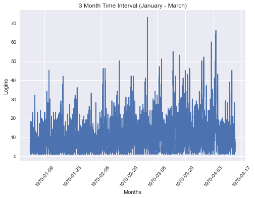
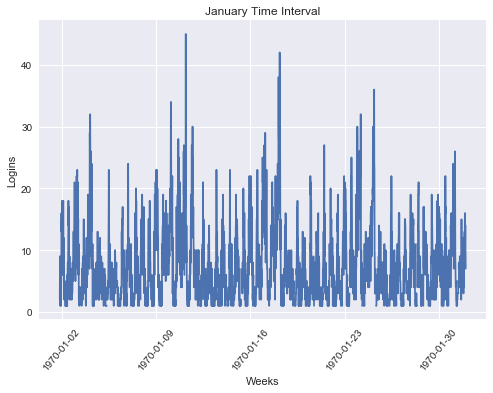
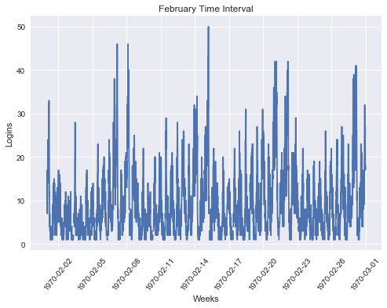
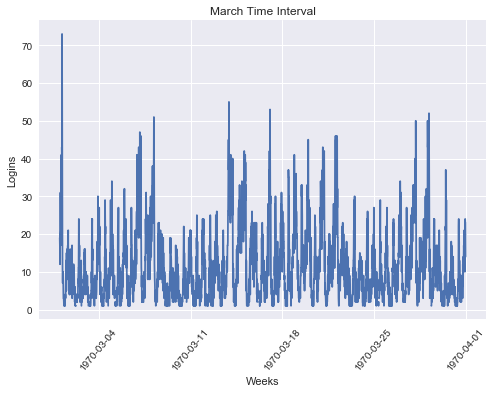
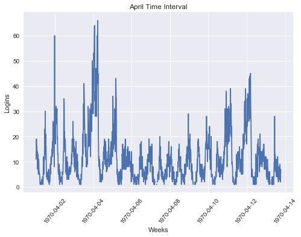
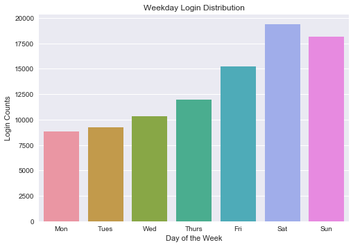
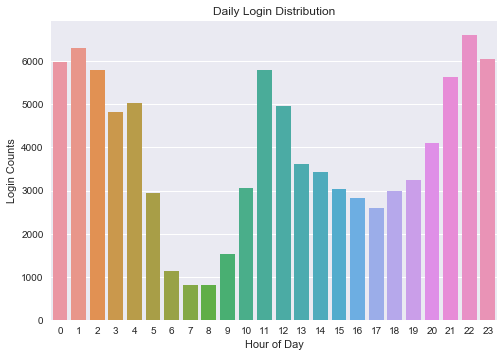

# Part 1 - Exploratory Data Analysis
***
The attached login.json file contains (simulated) timestamps of user logins in a particular geographic location. 

1. Aggregate these logins counts based on 15-minute time intervals
2. Visualize and describe the resulting time series of login counts in ways that best characterize the underlying patterns of the demand 
3. Please report/illustrate important features of the demand, such as daily cycles. If there are data quality issues, please report them.


```python
# Import necessary libraries 
import pandas as pd
import numpy as np
import seaborn as sns
import matplotlib.pyplot as plt
```


```python
# Load json file into pandas dataframe
df = pd.read_json('logins.json')
df.head()
```


<div>
<style>
    .dataframe thead tr:only-child th {
        text-align: right;
    }

    .dataframe thead th {
        text-align: left;
    }

    .dataframe tbody tr th {
        vertical-align: top;
    }
</style>
<table border="1" class="dataframe">
  <thead>
    <tr style="text-align: right;">
      <th></th>
      <th>login_time</th>
    </tr>
  </thead>
  <tbody>
    <tr>
      <th>0</th>
      <td>1970-01-01 20:13:18</td>
    </tr>
    <tr>
      <th>1</th>
      <td>1970-01-01 20:16:10</td>
    </tr>
    <tr>
      <th>2</th>
      <td>1970-01-01 20:16:37</td>
    </tr>
    <tr>
      <th>3</th>
      <td>1970-01-01 20:16:36</td>
    </tr>
    <tr>
      <th>4</th>
      <td>1970-01-01 20:26:21</td>
    </tr>
  </tbody>
</table>
</div>


```python
df.describe()
```


<div>
<style>
    .dataframe thead tr:only-child th {
        text-align: right;
    }

    .dataframe thead th {
        text-align: left;
    }

    .dataframe tbody tr th {
        vertical-align: top;
    }
</style>
<table border="1" class="dataframe">
  <thead>
    <tr style="text-align: right;">
      <th></th>
      <th>login_time</th>
    </tr>
  </thead>
  <tbody>
    <tr>
      <th>count</th>
      <td>93142</td>
    </tr>
    <tr>
      <th>unique</th>
      <td>92265</td>
    </tr>
    <tr>
      <th>top</th>
      <td>1970-02-12 11:16:53</td>
    </tr>
    <tr>
      <th>freq</th>
      <td>3</td>
    </tr>
    <tr>
      <th>first</th>
      <td>1970-01-01 20:12:16</td>
    </tr>
    <tr>
      <th>last</th>
      <td>1970-04-13 18:57:38</td>
    </tr>
  </tbody>
</table>
</div>


# Aggregate these logins counts based on 15-minute time intervals


```python
# First index on the timestamp column
df.set_index('login_time', inplace=True)

# Add a numeric column (you need something for resampling to aggregate)
df['count'] = 1

# Resample in 15minute time interval
df_15T = df.resample('15T', how='sum')
```

    C:\Users\Randy\Anaconda3\lib\site-packages\ipykernel_launcher.py:8: FutureWarning: how in .resample() is deprecated
    the new syntax is .resample(...).sum()
      
    


```python
df_15T.head()
```


<div>
<style>
    .dataframe thead tr:only-child th {
        text-align: right;
    }

    .dataframe thead th {
        text-align: left;
    }

    .dataframe tbody tr th {
        vertical-align: top;
    }
</style>
<table border="1" class="dataframe">
  <thead>
    <tr style="text-align: right;">
      <th></th>
      <th>count</th>
    </tr>
    <tr>
      <th>login_time</th>
      <th></th>
    </tr>
  </thead>
  <tbody>
    <tr>
      <th>1970-01-01 20:00:00</th>
      <td>2.0</td>
    </tr>
    <tr>
      <th>1970-01-01 20:15:00</th>
      <td>6.0</td>
    </tr>
    <tr>
      <th>1970-01-01 20:30:00</th>
      <td>9.0</td>
    </tr>
    <tr>
      <th>1970-01-01 20:45:00</th>
      <td>7.0</td>
    </tr>
    <tr>
      <th>1970-01-01 21:00:00</th>
      <td>1.0</td>
    </tr>
  </tbody>
</table>
</div>


# Graph the 3 Month Time Interval
***

**Summary:**

The graph here doesn't really display anything interesting. 

Since this is from a monthly standpoint, let's break it down into weeks, then to days, and then to hours.


```python
x = df_15T['login_time']
y = df_15T['count']
plt.plot(x, y)
plt.title('3 Month Time Interval (January - March)')
plt.xticks(rotation = 50)
plt.xlabel("Months")
plt.ylabel("Logins")
plt.show()
```





# Monthly Logins
*** 
**Summary:**

- It looks like March has the most logins for the month, followed by February, and then January.
- The Months all have similar distribution of logins
- Let's look into days of the week distribution of logins


```python
df_months = df_15T.groupby(df_15T['login_time'].dt.strftime('%B'))['count'].sum().sort_values()
```


```python
df_months.head()
```


    login_time
    April       13507.0
    January     21239.0
    February    24673.0
    March       33723.0
    Name: count, dtype: float64


## January Logins
***


```python
january = df_15T[(df_15T['login_time'] > '1970-01') & (df_15T['login_time'] < '1970-02')]
january.describe()
```


<div>
<style>
    .dataframe thead tr:only-child th {
        text-align: right;
    }

    .dataframe thead th {
        text-align: left;
    }

    .dataframe tbody tr th {
        vertical-align: top;
    }
</style>
<table border="1" class="dataframe">
  <thead>
    <tr style="text-align: right;">
      <th></th>
      <th>count</th>
    </tr>
  </thead>
  <tbody>
    <tr>
      <th>count</th>
      <td>2757.000000</td>
    </tr>
    <tr>
      <th>mean</th>
      <td>7.703663</td>
    </tr>
    <tr>
      <th>std</th>
      <td>6.019589</td>
    </tr>
    <tr>
      <th>min</th>
      <td>1.000000</td>
    </tr>
    <tr>
      <th>25%</th>
      <td>3.000000</td>
    </tr>
    <tr>
      <th>50%</th>
      <td>6.000000</td>
    </tr>
    <tr>
      <th>75%</th>
      <td>11.000000</td>
    </tr>
    <tr>
      <th>max</th>
      <td>45.000000</td>
    </tr>
  </tbody>
</table>
</div>


```python
# Plot January Logins
x = january['login_time']
y = january['count']
plt.plot(x, y)
plt.title('January Time Interval')
plt.xticks(rotation = 50)
plt.xlabel("Weeks")
plt.ylabel("Logins")
plt.show()
```





## February Logins
***


```python
february = df_15T[(df_15T['login_time'] > '1970-02') & (df_15T['login_time'] < '1970-03')]
february.describe()
```


<div>
<style>
    .dataframe thead tr:only-child th {
        text-align: right;
    }

    .dataframe thead th {
        text-align: left;
    }

    .dataframe tbody tr th {
        vertical-align: top;
    }
</style>
<table border="1" class="dataframe">
  <thead>
    <tr style="text-align: right;">
      <th></th>
      <th>count</th>
    </tr>
  </thead>
  <tbody>
    <tr>
      <th>count</th>
      <td>2561.000000</td>
    </tr>
    <tr>
      <th>mean</th>
      <td>9.629442</td>
    </tr>
    <tr>
      <th>std</th>
      <td>7.710417</td>
    </tr>
    <tr>
      <th>min</th>
      <td>1.000000</td>
    </tr>
    <tr>
      <th>25%</th>
      <td>4.000000</td>
    </tr>
    <tr>
      <th>50%</th>
      <td>8.000000</td>
    </tr>
    <tr>
      <th>75%</th>
      <td>13.000000</td>
    </tr>
    <tr>
      <th>max</th>
      <td>50.000000</td>
    </tr>
  </tbody>
</table>
</div>


```python
# Plot February Logins
x = february['login_time']
y = february['count']
plt.plot(x, y)
plt.title('February Time Interval')
plt.xticks(rotation = 50)
plt.xlabel("Weeks")
plt.ylabel("Logins")
plt.show()
```





## March Logins
***


```python
march = df_15T[(df_15T['login_time'] > '1970-03') & (df_15T['login_time'] < '1970-04')]
march.describe()
```


<div>
<style>
    .dataframe thead tr:only-child th {
        text-align: right;
    }

    .dataframe thead th {
        text-align: left;
    }

    .dataframe tbody tr th {
        vertical-align: top;
    }
</style>
<table border="1" class="dataframe">
  <thead>
    <tr style="text-align: right;">
      <th></th>
      <th>count</th>
    </tr>
  </thead>
  <tbody>
    <tr>
      <th>count</th>
      <td>2869.000000</td>
    </tr>
    <tr>
      <th>mean</th>
      <td>11.748693</td>
    </tr>
    <tr>
      <th>std</th>
      <td>9.245637</td>
    </tr>
    <tr>
      <th>min</th>
      <td>1.000000</td>
    </tr>
    <tr>
      <th>25%</th>
      <td>5.000000</td>
    </tr>
    <tr>
      <th>50%</th>
      <td>9.000000</td>
    </tr>
    <tr>
      <th>75%</th>
      <td>16.000000</td>
    </tr>
    <tr>
      <th>max</th>
      <td>73.000000</td>
    </tr>
  </tbody>
</table>
</div>


```python
# Plot February Logins
x = march['login_time']
y = march['count']
plt.plot(x, y)
plt.title('March Time Interval')
plt.xticks(rotation = 50)
plt.xlabel("Weeks")
plt.ylabel("Logins")
plt.show()
```





## April Login
***


```python
april = df_15T[(df_15T['login_time'] > '1970-04') ]
april.describe()
```


<div>
<style>
    .dataframe thead tr:only-child th {
        text-align: right;
    }

    .dataframe thead th {
        text-align: left;
    }

    .dataframe tbody tr th {
        vertical-align: top;
    }
</style>
<table border="1" class="dataframe">
  <thead>
    <tr style="text-align: right;">
      <th></th>
      <th>count</th>
    </tr>
  </thead>
  <tbody>
    <tr>
      <th>count</th>
      <td>1191.000000</td>
    </tr>
    <tr>
      <th>mean</th>
      <td>11.328296</td>
    </tr>
    <tr>
      <th>std</th>
      <td>9.935110</td>
    </tr>
    <tr>
      <th>min</th>
      <td>1.000000</td>
    </tr>
    <tr>
      <th>25%</th>
      <td>4.000000</td>
    </tr>
    <tr>
      <th>50%</th>
      <td>9.000000</td>
    </tr>
    <tr>
      <th>75%</th>
      <td>15.000000</td>
    </tr>
    <tr>
      <th>max</th>
      <td>66.000000</td>
    </tr>
  </tbody>
</table>
</div>


```python
# Plot April Logins
x = april['login_time']
y = april['count']
plt.plot(x, y)
plt.title('April Time Interval')
plt.xticks(rotation = 50)
plt.xlabel("Weeks")
plt.ylabel("Logins")

plt.show()
```





# Daily Logins (Monday-Sunday)
***
**Summary:**

- It looks like the distribution of logins are increasing as the days go by. 
- Saturday has the highest amount of logins
- Weekends display the most logins


```python
#Reset index first
# df_15T.reset_index(inplace=True)

# Counting based on weekdays, 0 = Monday, 6 = Sunday
df_15T['weekday'] = df_15T['login_time'].dt.dayofweek
df_weekday = df_15T.sort_values(by='count', ascending=False)
weekday_counts = df_weekday[['count', 'weekday']]
weekday_counts = weekday_counts.groupby('weekday').sum().reset_index()
weekday_counts
```


<div>
<style>
    .dataframe thead tr:only-child th {
        text-align: right;
    }

    .dataframe thead th {
        text-align: left;
    }

    .dataframe tbody tr th {
        vertical-align: top;
    }
</style>
<table border="1" class="dataframe">
  <thead>
    <tr style="text-align: right;">
      <th></th>
      <th>weekday</th>
      <th>count</th>
    </tr>
  </thead>
  <tbody>
    <tr>
      <th>0</th>
      <td>0</td>
      <td>8823.0</td>
    </tr>
    <tr>
      <th>1</th>
      <td>1</td>
      <td>9268.0</td>
    </tr>
    <tr>
      <th>2</th>
      <td>2</td>
      <td>10339.0</td>
    </tr>
    <tr>
      <th>3</th>
      <td>3</td>
      <td>11960.0</td>
    </tr>
    <tr>
      <th>4</th>
      <td>4</td>
      <td>15208.0</td>
    </tr>
    <tr>
      <th>5</th>
      <td>5</td>
      <td>19377.0</td>
    </tr>
    <tr>
      <th>6</th>
      <td>6</td>
      <td>18167.0</td>
    </tr>
  </tbody>
</table>
</div>


```python
weekday_counts['weekday'] = ['Mon', 'Tues', 'Wed','Thurs','Fri', 'Sat', 'Sun']
weekday_counts = weekday_counts[['weekday','count']]
weekday_counts
```


<div>
<style>
    .dataframe thead tr:only-child th {
        text-align: right;
    }

    .dataframe thead th {
        text-align: left;
    }

    .dataframe tbody tr th {
        vertical-align: top;
    }
</style>
<table border="1" class="dataframe">
  <thead>
    <tr style="text-align: right;">
      <th></th>
      <th>weekday</th>
      <th>count</th>
    </tr>
  </thead>
  <tbody>
    <tr>
      <th>0</th>
      <td>Mon</td>
      <td>8823.0</td>
    </tr>
    <tr>
      <th>1</th>
      <td>Tues</td>
      <td>9268.0</td>
    </tr>
    <tr>
      <th>2</th>
      <td>Wed</td>
      <td>10339.0</td>
    </tr>
    <tr>
      <th>3</th>
      <td>Thurs</td>
      <td>11960.0</td>
    </tr>
    <tr>
      <th>4</th>
      <td>Fri</td>
      <td>15208.0</td>
    </tr>
    <tr>
      <th>5</th>
      <td>Sat</td>
      <td>19377.0</td>
    </tr>
    <tr>
      <th>6</th>
      <td>Sun</td>
      <td>18167.0</td>
    </tr>
  </tbody>
</table>
</div>


```python
sns.barplot(x= 'weekday', y='count', data=weekday_counts)
plt.xlabel('Day of the Week')
plt.title('Weekday Login Distribution')
plt.ylabel('Login Counts')
plt.show()
```





```python
#Reset index first
#df_15T.reset_index(inplace=True)

# Counting based on weekdays, 0 = Monday, 6 = Sunday
df_15T['hour'] = df_15T['login_time'].dt.hour
df_hour = df_15T.sort_values(by='count', ascending=False)
hour_counts = df_hour[['count', 'hour']]
hour_counts = df_hour.groupby('hour').sum().reset_index()
hour_counts
```


<div>
<style>
    .dataframe thead tr:only-child th {
        text-align: right;
    }

    .dataframe thead th {
        text-align: left;
    }

    .dataframe tbody tr th {
        vertical-align: top;
    }
</style>
<table border="1" class="dataframe">
  <thead>
    <tr style="text-align: right;">
      <th></th>
      <th>hour</th>
      <th>level_0</th>
      <th>index</th>
      <th>count</th>
      <th>weekday</th>
    </tr>
  </thead>
  <tbody>
    <tr>
      <th>0</th>
      <td>0</td>
      <td>1985124</td>
      <td>1985124</td>
      <td>5993.0</td>
      <td>1236</td>
    </tr>
    <tr>
      <th>1</th>
      <td>1</td>
      <td>1986756</td>
      <td>1986756</td>
      <td>6317.0</td>
      <td>1236</td>
    </tr>
    <tr>
      <th>2</th>
      <td>2</td>
      <td>1988388</td>
      <td>1988388</td>
      <td>5800.0</td>
      <td>1236</td>
    </tr>
    <tr>
      <th>3</th>
      <td>3</td>
      <td>1990020</td>
      <td>1990020</td>
      <td>4831.0</td>
      <td>1236</td>
    </tr>
    <tr>
      <th>4</th>
      <td>4</td>
      <td>1991652</td>
      <td>1991652</td>
      <td>5034.0</td>
      <td>1236</td>
    </tr>
    <tr>
      <th>5</th>
      <td>5</td>
      <td>1993284</td>
      <td>1993284</td>
      <td>2945.0</td>
      <td>1236</td>
    </tr>
    <tr>
      <th>6</th>
      <td>6</td>
      <td>1994916</td>
      <td>1994916</td>
      <td>1138.0</td>
      <td>1236</td>
    </tr>
    <tr>
      <th>7</th>
      <td>7</td>
      <td>1996548</td>
      <td>1996548</td>
      <td>815.0</td>
      <td>1236</td>
    </tr>
    <tr>
      <th>8</th>
      <td>8</td>
      <td>1998180</td>
      <td>1998180</td>
      <td>818.0</td>
      <td>1236</td>
    </tr>
    <tr>
      <th>9</th>
      <td>9</td>
      <td>1999812</td>
      <td>1999812</td>
      <td>1527.0</td>
      <td>1236</td>
    </tr>
    <tr>
      <th>10</th>
      <td>10</td>
      <td>2001444</td>
      <td>2001444</td>
      <td>3064.0</td>
      <td>1236</td>
    </tr>
    <tr>
      <th>11</th>
      <td>11</td>
      <td>2003076</td>
      <td>2003076</td>
      <td>5799.0</td>
      <td>1236</td>
    </tr>
    <tr>
      <th>12</th>
      <td>12</td>
      <td>2004708</td>
      <td>2004708</td>
      <td>4964.0</td>
      <td>1236</td>
    </tr>
    <tr>
      <th>13</th>
      <td>13</td>
      <td>2006340</td>
      <td>2006340</td>
      <td>3611.0</td>
      <td>1236</td>
    </tr>
    <tr>
      <th>14</th>
      <td>14</td>
      <td>2007972</td>
      <td>2007972</td>
      <td>3426.0</td>
      <td>1236</td>
    </tr>
    <tr>
      <th>15</th>
      <td>15</td>
      <td>2009604</td>
      <td>2009604</td>
      <td>3038.0</td>
      <td>1236</td>
    </tr>
    <tr>
      <th>16</th>
      <td>16</td>
      <td>2011236</td>
      <td>2011236</td>
      <td>2832.0</td>
      <td>1236</td>
    </tr>
    <tr>
      <th>17</th>
      <td>17</td>
      <td>2012868</td>
      <td>2012868</td>
      <td>2584.0</td>
      <td>1236</td>
    </tr>
    <tr>
      <th>18</th>
      <td>18</td>
      <td>2014500</td>
      <td>2014500</td>
      <td>2980.0</td>
      <td>1236</td>
    </tr>
    <tr>
      <th>19</th>
      <td>19</td>
      <td>1976974</td>
      <td>1976974</td>
      <td>3235.0</td>
      <td>1236</td>
    </tr>
    <tr>
      <th>20</th>
      <td>20</td>
      <td>1978596</td>
      <td>1978596</td>
      <td>4103.0</td>
      <td>1248</td>
    </tr>
    <tr>
      <th>21</th>
      <td>21</td>
      <td>1980228</td>
      <td>1980228</td>
      <td>5623.0</td>
      <td>1248</td>
    </tr>
    <tr>
      <th>22</th>
      <td>22</td>
      <td>1981860</td>
      <td>1981860</td>
      <td>6607.0</td>
      <td>1248</td>
    </tr>
    <tr>
      <th>23</th>
      <td>23</td>
      <td>1983492</td>
      <td>1983492</td>
      <td>6058.0</td>
      <td>1248</td>
    </tr>
  </tbody>
</table>
</div>


```python
sns.barplot(x= 'hour', y='count', data=hour_counts)
plt.xlabel('Hour of Day')
plt.title('Daily Login Distribution')
plt.ylabel('Login Counts')
plt.show()
```





```python

```
